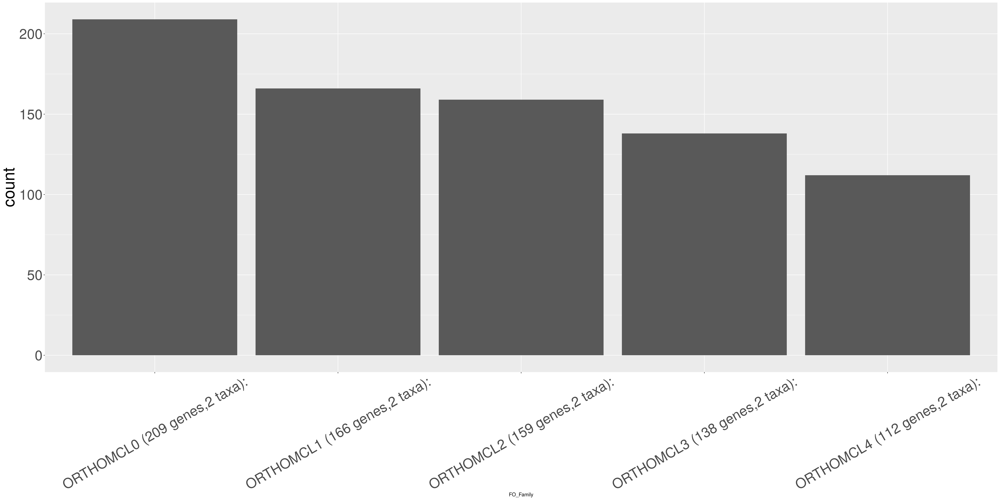
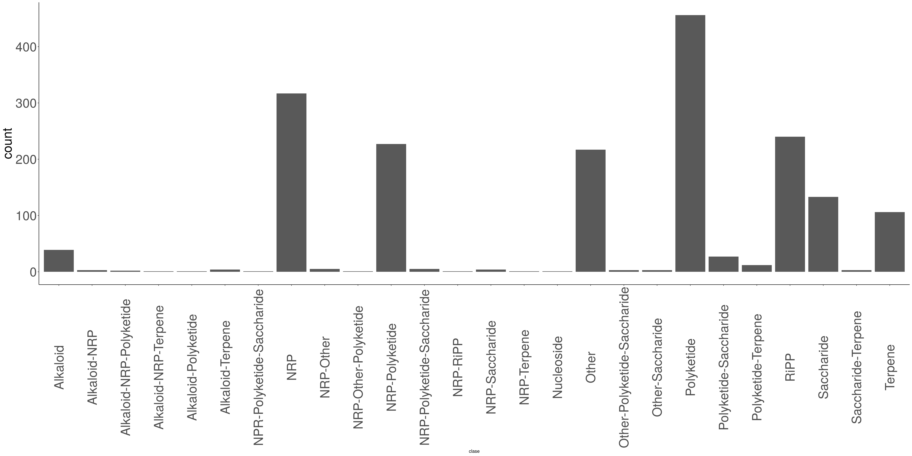
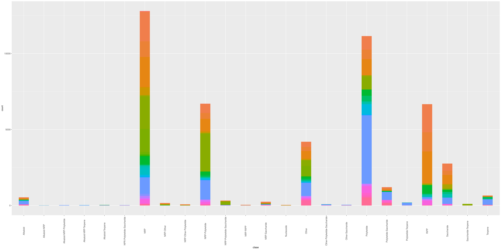
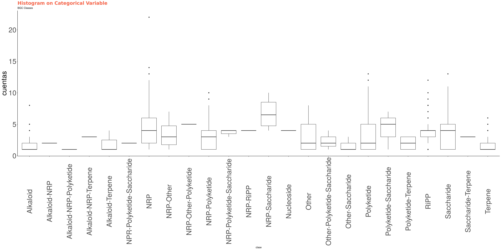

```{r setup, include=FALSE}
knitr::opts_chunk$set(echo = TRUE)
library(readr)
library(ggplot2)
library(plyr)
library( reshape )
library(data.table)
library(easyGgplot2)

library(dplyr)
```

## DATA  
CARD database contains antibiotic resistance (AR) genes.  
MIBiG database is composed by Biosynthetic gene clusters.  
antiSMASHDB contains predicted BGCs.  

## Methodology
### CARD gene families  
Genes in CARD were classified into gene families using FastORTHO with default parameters.    

### Homology searches between CARD and MIBiG  
Homology search was conducted using blast (e-vaule ) in an all vs all comparison with query antibiotic resistance genes from The Comprehensive Antibiotic Resistance Database (CARD) against genes in BGCs from MIBiG database.  

In the following sections we will refer to the following questions: How many BGCs contain an AR gene?
¿How many families of AR genes are present in BGCs? Which families are over represented? How many BGCs per AR gene/Family?


# Protein families in CARD  
The following figure shows the most populated families in CARD database.
```{r FO_reading_families_CARD, echo=FALSE,message=FALSE, include=FALSE, results='hide', warnings=FALSE}
#CAARD_file="CARD.FO.families"
CAARD_file="FAST.ORTHO.PFAM"

Pre_CARDFamiliesTable <- read_delim(CAARD_file, "\t", escape_double = FALSE, col_names = FALSE, trim_ws = TRUE)
colnames(Pre_CARDFamiliesTable)=c("Gen_ID_CARD","secondary_ID_CARD","FO_Family","oldfamily")
#head(CARDFamiliesTable)
CARDFamiliesTable<-subset(Pre_CARDFamiliesTable, FO_Family!="none")
#Gen_Id, Familia (según fastOrtho)
## Counting number of families 
AllFamilies<-length(unique(CARDFamiliesTable$FO_Family))
WO_singletons<-length(grep("ORTHO", unique(CARDFamiliesTable$FO_Family)))
sort(table(CARDFamiliesTable$FO_Family))

```

The total number of antibiotic gene resistance families is `r AllFamilies` counting singletons. Without singletons there are `r WO_singletons` families.


<!--- Dany is currently classifing families by two methods hmmscan (pfam domains) and blasting their members -->
These first five families, in a preliminar search corresponds to:  
  
|  Family	| Number of genes	| Annotation|    
|---	|---	|---  |    
| Family 0 	| 647 	|$\beta$-lactamase 2 |   
| Family 1  	| 302	| $\beta$-lactamase |   
| Family 2	| 283 	| Transpeptidase     |   
| Family 3 	| 103 	| class B extended-spectrum $\beta$-lactamase |   
| Family 4 	| 55 	| MFS_1|   
  


```{r FO_families_CARD, echo=FALSE,message=FALSE, include=FALSE, results='hide', warnings=FALSE}
#Cada renglón es una ocurrencia de un gen de la familia 
#CARDFamiliesTable$FO_Family
sortCARD<-CARDFamiliesTable %>% group_by(FO_Family) %>% mutate(n=n())%>% ungroup() %>% arrange(-n)
sortCARD
First_10<-sortCARD[1:1582,]
tail(First_10)

First_10$FO_Family <- reorder(First_10$FO_Family,First_10$FO_Family,FUN=length)
levels(First_10$FO_Family)
sort(table(First_10$FO_Family))


CARD_bars<-ggplot(First_10, aes(FO_Family))+ geom_histogram(stat="count")+ theme(plot.title=element_text(size=20, 
                                    face="bold", 
                                    family="American Typewriter",
                                    color="tomato",
                                    lineheight=1.2),  # title
            axis.title.y=element_text(size=35),  # Y axis title
            axis.text.x=element_text(size=30, 
                                     angle = 30,
                                     vjust=.5),  # X axis text
            axis.text.y=element_text(size=30))  # Y axis text
ggsave(file="CARD_bars.svg", plot=CARD_bars, width=30, height=15)
#  

```


# BGC clases in MiBIG  
The following figure shows the most populated classes in MiBIG database.

```{r MiBIG, echo=FALSE,message=FALSE, include=FALSE, results='hide', warnings=FALSE}
MIBiG_file="data/MiBIG_DB.faa.meta"
MIBiGTable <- read_delim(MIBiG_file, "\t", escape_double = FALSE, col_names = FALSE, trim_ws = TRUE)
#Gen_Id, Familia (según fastOrtho)
#Cada renglón es una ocurrencia de un gen de la familia 1
colnames(MIBiGTable)=c("BGC_ID","compound","clase","source","phylum","kingdom","completness")
BGCs<-length(unique(MIBiGTable$BGC_ID))

sortMIBiG<-MIBiGTable %>% group_by(clase) %>% mutate(n=n())%>% ungroup() %>% arrange(-n)
sortMIBiG$clase <- reorder(sortMIBiG$clase,sortMIBiG$clase,FUN=length)
levels(sortMIBiG$clase)
sort(table(sortMIBiG$clase))

#First_10_MIBiG<-sortMIBiG[1:784,]
#head(First_10_MIBiG)


BIG_classes<-ggplot(sortMIBiG, aes(clase))+ geom_histogram(stat="count", width = 0.7)+ theme(plot.title=element_text(size=20, 
                                    face="bold", 
                                    family="American Typewriter",
                                    color="tomato",
                                    lineheight=1.2),  # title
            axis.title.y=element_text(size=30),  # Y axis title
            axis.text.x=element_text(size=30, 
                                     angle = 90,
                                     vjust=.5),  # X axis text
            axis.text.y=element_text(size=30))  # Y axis text

ggsave(file="BIG_classes.svg", plot=BIG_classes, width=30, height=15)

```
  

There are `r BGCs` different BGCs reported at MIBiG distributed in several classes as indicated in the following table.   
    
|Elements | MIBiG class |   
|--- |---  |    
|39|Alkaloid|      
|3|Alkaloid-NRP|  
|2|Alkaloid-NRP-Polyketide|  
|1|Alkaloid-NRP-Terpene|  
|1|Alkaloid-Polyketide|  
|4|Alkaloid-Terpene|  
|1|NPR-Polyketide-Saccharide|  
|317|NRP|  
|5|NRP-Other|  
|1|NRP-Other-Polyketide|  
|227|NRP-Polyketide|  
|5|NRP-Polyketide-Saccharide|  
|1|NRP-RiPP|  
|4|NRP-Saccharide|  
|1|NRP-Terpene|  
|1|Nucleoside|  
|217|Other|  
|3|Other-Polyketide-Saccharide|  
|3|Other-Saccharide|  
|456|Polyketide|  
|27|Polyketide-Saccharide|  
|12|Polyketide-Terpene|  
|240|RiPP|  
|133|Saccharide|  
|3|Saccharide-Terpene|  
|106|Terpene|

\newpage
# CARD families and their interaction with BGCs in MIBiG  
  
MIBiG is classified in 24 classes, each one contains a variable number of BGCs  
$c_1=\{c_1^1,c_2^1,c_3^1,... , c_{n1}^1\}$  
  
$c_2=\{c_1^2,c_2^2,c_3^2,... , c_{n1}^1\}$  
  .  
  .  
  .  
    
$c_{24}=\{c_1^{24},c_2^{24},c_3^{24},... , c_{n24}^{24}\}$  
    
     
CARD is divided in 645 families each one with a variable number of genes       
$f_1=\{f_1^1,f_2^1,f_3^1,... , f_{n1}^1\}$     
  
$f_2=\{f_1^2,f_2^2,f_3^2,... , f_{n1}^1\}$  
  .  
  .  
  .  
    
$f_{645}=\{f_1^{645},f_2^{645},f_3^{645},... , f_{n645}^{645}\}$  

$A(f,c)=\frac{\#~hits~ of ~c~ ~over~ f}{(\#f)\times(\#c)}$

Average of blast hits of the family $f$ over the class $c$ where normalized by the size of these sets, $\#f$ and $\#c$ represent the number of elements in family $f$ and class $c$ respectively.

```{r CAARD_families_in_MIBiG, echo=FALSE,message=FALSE, include=FALSE, results='hide', warnings=FALSE }
CARD_vs_MIBiG_file="CARDquery.blast1" #(Query card) vs MIBiG 
CARD_vs_MIBiGTable <- read_delim(CARD_vs_MIBiG_file, "\t", escape_double = FALSE, col_names = FALSE, trim_ws = TRUE)
#Cada renglón es una ocurrencia de un gen de la familia 1
colnames(CARD_vs_MIBiGTable)=c("Gen_ID_CARD","CARD_SOURCE","BGC_ID","MIBIG_annotation","MIBIG_gen_Id")
BGC_w_CARD<-length(unique(CARD_vs_MIBiGTable$BGC_ID)) # Number of times that BGC in MIBiG is hit of a Card gene

### Merging all tables in one
CARD_MIBiG_class<-merge(CARD_vs_MIBiGTable, MIBiGTable, by, by.x="BGC_ID", by.y="BGC_ID", sort = TRUE)
CARD_MIBiG_FULL<-merge(CARD_MIBiG_class, CARDFamiliesTable, by, by.x="Gen_ID_CARD", by.y="Gen_ID_CARD", sort = TRUE)
```

The following analysis finds the most represented CARD families by MIBiG classes. An average about how many hits normalized by the family size and the number of BGCs elements of the class.

<!-- 
# Which CARD class has more BGC hits
# Family(I) = {f1,f2,....,fm}
#Class (J)= {c1,c2,...ck}
# The metric will be the average of hits of a BGC in a BGC class in a gen member of a CARD family 
# Average (I,J) =(fi,cj)/((#FI)(#CJ))
# The pairs that are blast hits of an element of a BGC Class in Elements of a CARD Family 
#(Class,Family) /(#(Elemnts in class)(#Elements in family ) )
!-->
```{r CAARD_families_in_MIBiG_2, echo=FALSE,message=FALSE, include=FALSE, results='hide', warnings=FALSE } 
## asign to each triada of family, Class, BGC element, how many hits were found
#sort.CARD_MIBiG_FULL<-CARD_MIBiG_FULL %>% group_by(FO_Family,clase,BGC_ID) %>%tally()
sort.pairs.F_C<-CARD_MIBiG_FULL %>% group_by(FO_Family,secondary_ID_CARD,clase,BGC_ID) %>%tally()

## Counts uniq triadas  by Family
#sort.by.family.CARD_MIBiG_FULL<-sort.CARD_MIBiG_FULL %>% group_by(FO_Family) %>% mutate(n=n())%>% ungroup() %>% arrange(-n)

sort.by.family.CARD_MIBiG_FULL<-sort.pairs.F_C %>% group_by(FO_Family,clase) %>% mutate(n=n())%>% ungroup() %>% arrange(-n)
# columna con numero de elementos de la familia que ocurre en ese renglon 
sort.by.family.CARD_MIBiG_FULL$FO_Family


### Function to obtain cardinality of a family
#w<-"ORTHOMCL24 (12 genes,1 taxa):"
FamilyNumber <- function(x){ ## is a column
  cuenta<-unique(sortCARD$n[which(sortCARD$FO_Family ==x)])
return(cuenta)
}
#y<-FamilyNumber(w)
#y
## Creating a column with family cardinality 
sort.by.family.CARD_MIBiG_FULL$FamilyCardinality<-lapply(sort.by.family.CARD_MIBiG_FULL$FO_Family,FamilyNumber)

### Function to obtain cardinality of a class
ClassNumber <- function(x){ ## is a column
  elementos<-unique(sortMIBiG$n[which(sortMIBiG$clase ==x)])
return(elementos)
}
## Creating a column with family cardinality 
sort.by.family.CARD_MIBiG_FULL$ClaseCardinality<-lapply(sort.by.family.CARD_MIBiG_FULL$clase,ClassNumber)

## Obtaining the average 
sort.by.family.CARD_MIBiG_FULL$average=(sort.by.family.CARD_MIBiG_FULL$n)/((as.numeric(sort.by.family.CARD_MIBiG_FULL$FamilyCardinality))*(as.numeric(sort.by.family.CARD_MIBiG_FULL$ClaseCardinality)))
# number of families 
#length(unique(sort.by.family.CARD_MIBiG_FULL$FO_Family))
tail(sort.by.family.CARD_MIBiG_FULL$average)

AverageFamily<-sort.by.family.CARD_MIBiG_FULL %>% group_by(FO_Family,clase,average) %>%tally()

# First 16 families in CARD (Most abundant)
First_10sort.by.family.CARD_MIBiG_FULL<-sortCARD[1:1084,]
length(unique(First_10sort.by.family.CARD_MIBiG_FULL$FO_Family))

### Q1 : In this comprised dataset by class ¿which was the most abundant family?
 #Family of() max (average which class = ?))
#    [max

MaxFamilybyClass <- function(x){ ## is a column
  ave<-AverageFamily$average[which(  AverageFamily$clase == x )]
  max_ave<-unique(ave[which(ave==max(ave))])
  max_fam<-AverageFamily$FO_Family[which(AverageFamily$clase == x & AverageFamily$average == max_ave)]
  return(c(x,max_ave,max_fam))
}
# Class, Max Average, #families with max average
maximosbyClass<-lapply(unique(sort.by.family.CARD_MIBiG_FULL$clase),MaxFamilybyClass)
maximosbyClass

## Q2 which is the highest average by family and to which class corresponds
##
MaxClassbyFamily <- function(x){ ## is a column
  ave<-AverageFamily$average[which(  AverageFamily$FO_Family == x )]
  max_ave<-unique(ave[which(ave==max(ave))])
  max_clase<-AverageFamily$clase[which(AverageFamily$FO_Family == x & AverageFamily$average == max_ave)]
  
  return(c(x,max_ave,max_clase))
}

maximosbyFamily<-lapply(unique(sort.by.family.CARD_MIBiG_FULL$FO_Family),MaxClassbyFamily)
maximosbyFamily[order( sapply(maximosbyFamily,'[[',2))]
 
### Q3 Which families only hits one class, and the which class?? 

FamilySpecificofClass<- function(x){ ## is a column
  Clases<-AverageFamily$clase[which(  AverageFamily$FO_Family == x )]
  NumberOfClases<-length(unique(Clases))
  return(c(x,NumberOfClases,unique(Clases)))
}

ClasesbyFamily<-lapply(unique(sort.by.family.CARD_MIBiG_FULL$FO_Family),FamilySpecificofClass)
## These families only hits one class
head(ClasesbyFamily[order( sapply(ClasesbyFamily,'[[',2))],119)
## These classes are the only hits of several families
unique(sapply(head(ClasesbyFamily[order(sapply(ClasesbyFamily,'[[',2))],119),'[[',3))

```

The following figure shows MIBiG Clases, and in each class stacks a CARD family average
```{r CAARD_vs_MiBIG_family_average, echo=FALSE,message=FALSE, include=FALSE, results='hide', warnings=FALSE }


## First of all, how many BGCs contain a hit in CARD 
## Count uniq BGCs

AverageFamily$average <- reorder(AverageFamily$average,AverageFamily$average,FUN=length)
levels(AverageFamily$average)
sort(table(AverageFamily$average))

ggplot(AverageFamily, aes(x = clase, y = average)) +geom_point(aes(color = FO_Family, size =  average))+ theme(legend.position = "none", plot.title=element_text(size=20, 
                                    face="bold", 
                                    family="American Typewriter",
                                    color="tomato",
                                    lineheight=1.2),  # title
            axis.title.y=element_text(size=10),  # Y axis title
            axis.text.x=element_text(size=10, 
                                     angle = 90,
                                     vjust=.5),  # X axis text
            axis.text.y=element_text(size=10))  # Y axis text


CARD_BIG_family_average<-ggplot(AverageFamily, aes(x = clase, y = average))+  geom_col(aes(fill = FO_Family), width = 0.7)+ theme(legend.position = "none", plot.title=element_text(size=20, 
                                    face="bold", 
                                    family="American Typewriter",
                                    color="tomato",
                                    lineheight=1.2),  # title
            axis.title.y=element_text(size=40),  # Y axis title
            axis.text.x=element_text(size=40, 
                                     angle = 90,
                                     vjust=.5),  # X axis text
            axis.text.y=element_text(size=40))  # Y axis text


ggsave(file="CARD_BIG_family_average.svg", plot=CARD_BIG_family_average, width=30, height=15)

#+ geom_bar(aes(fill=FO_Family), width = 0.5)


## no w in facets

```

  
The following figure shows the average of CARD families by MIBiG classes


```{r familia_eje_X, eval=FALSE}
CARD_BIG_family_averageHorizontal<-ggplot(AverageFamily, aes(x = FO_Family , y = average))+  geom_col(aes(fill = clase), width = 0.7)+ theme(legend.position = "right", plot.title=element_text(size=20, 
                                    face="bold", 
                                    family="American Typewriter",
                                    color="tomato",
                                    lineheight=1.2),  # title
            axis.title.y=element_text(size=1),  # Y axis title
            axis.text.x=element_text(size=1, 
                                     angle = 90,
                                     vjust=.5),  # X axis text
            axis.text.y=element_text(size=1))  # Y axis text
#ggsave(file="CARD_BIG_family_averageHorizontal.svg", plot=CARD_BIG_family_averageHorizontal, width=30, height=15)
ggsave(file="CARD_BIG_family_averageHorizontal_with_leyend.svg", plot=CARD_BIG_family_averageHorizontal, width=30, height=15)

#bb_AverageFamily <- match_df(AverageFamily, "AAA50325.1|ARO:3003036|oleB", on="id")
## Now I want to substet the families with the highets average #3 
# I look into inkscape to determine the 10 highest picks

list<-c("AAA50325.1|ARO:3003036|oleB","AAV85982.1|ARO:3000535|macB","APB03219.1|ARO:3003986|TaeA","CAD70268.1|ARO:3002704|fexA","NP_388442.1|ARO:3004476|vmlR","ORTHOMCL108 (3 genes,2 taxa):","ORTHOMCL150 (2 genes,1 taxa):","ORTHOMCL165 (2 genes,1 taxa):","ORTHOMCL300 (2 genes,1 taxa):","ORTHOMCL65 (4 genes,2 taxa):","ORTHOMCL72 (4 genes,2 taxa):")
#APB03216.1|ARO:3003982|LlmA
### Now We substet this list
#AverageFamily$FO_Family[which(
#    AverageFamily$FO_Family == "AAA50325.1|ARO:3003036|oleB"|AverageFamily$FO_Family == "AAV85981.1|ARO:3000533|macA" | )]

bb_AverageFamily <- AverageFamily[AverageFamily$FO_Family %in% list, ]
CARD_BIG_family_averageHorizontalSubset<-  ggplot(bb_AverageFamily, aes(x = FO_Family , y = average))+  geom_col(aes(fill = clase), width = 0.7)+facet_grid(bb_AverageFamily$clase ~ .)+ theme(legend.position = "right", plot.title=element_text(size=50, 
                                    face="bold", 
                                    family="American Typewriter",
                                    color="tomato",
                                    lineheight=1.2),  # title
            axis.title.y=element_text(size=20),  # Y axis title
            axis.text.x=element_text(size=20, 
                                     angle = 90,
                                     vjust=.5),  # X axis text
            axis.text.y=element_text(size=20))  # Y axis text
ggsave(file="CARD_BIG_family_averageHorizontal_with_leyend_Subset.svg", plot=CARD_BIG_family_averageHorizontalSubset, width=30, height=15)

```


```{r CAARD_vs_MiBIG, echo=FALSE,message=FALSE, include=FALSE, results='hide', warnings=FALSE }


## First of all, how many BGCs contain a hit in CARD 
## Count uniq BGCs

CARD_BIG_clases<-ggplot(CARD_MIBiG_FULL,aes(clase)) + geom_bar(aes(fill=FO_Family), width = 0.5) + theme(legend.position = "none",plot.title=element_text(size=20, 
                                    face="bold", 
                                    family="American Typewriter",
                                    color="tomato",
                                    lineheight=1.2),  # title
            axis.title.y=element_text(size=10),  # Y axis title
            axis.text.x=element_text(size=10, 
                                     angle = 90,
                                     vjust=.5),  # X axis text
            axis.text.y=element_text(size=10))  # Y axis text
ggsave(file="CARD_BIG_clases.png", plot=CARD_BIG_clases, width=30, height=15)

#+ geom_bar(aes(fill=FO_Family), width = 0.5)


```

From `r BGCs` different BGCs at MIBiG `r BGC_w_CARD` contains a CARD hit

The following figure shows which CARD families are the most  populated classes in MiBIG database.
and now an histogram by class with the number of BGCs with diferente frequecnies or CARd by color

  

which MiBiG classes are over represented as CARD hits
<!--
# Which MiBig class has more CARD family hits
# The metric will be the average of hits of a gene in a Family in a BGC in a BGC class
# The pairs that are blast hits of an element of a CARD family in a BGC Class 
#(Class,Family) /(#(Elemnts in class)(#Elements in family ) )
!-->
!-->
### OLD CODE

```{r CAARD_vs_MiBIG_2, echo=FALSE,message=FALSE, include=FALSE, results='hide', warnings=FALSE }
## Counting CARD FastOrthoFamilies per BGC
cuentas<-count(CARD_MIBiG_FULL %>% group_by(BGC_ID,FO_Family) %>% tally())
colnames(cuentas)=c("BGC_ID","cuentas")
head(cuentas)
## Here are in cuentas the number of FASTORTHO CARD families per BGC  
CARD_MIBiG_todo<-merge(CARD_MIBiG_FULL, cuentas, by, by.x="BGC_ID", by.y="BGC_ID", sort = TRUE)

##Now I wan thre columns class, BGC , # CARD families
Clas_BGC_Count<-CARD_MIBiG_todo %>% group_by(clase,BGC_ID,cuentas) %>% tally()
head (Clas_BGC_Count,100)
theme_set(theme_classic())


CARD_in_BIG<-ggplot(Clas_BGC_Count,aes(x = clase, y = cuentas))+ geom_boxplot() + theme(axis.text.x = element_text(angle=65, vjust=0.6)) + labs(title="Histogram on Categorical Variable", 
       subtitle="BGC Classes") + theme(legend.position = "none",plot.title=element_text(size=20, 
                                    face="bold", 
                                    family="American Typewriter",
                                    color="tomato",
                                    lineheight=1.2),  # title
            axis.title.y=element_text(size=30),  # Y axis title
            axis.text.x=element_text(size=30, 
                                     angle = 90,
                                     vjust=.5),  # X axis text
            axis.text.y=element_text(size=30))  # Y axis text

ggsave(file="CARD_in_BIG.png", plot=CARD_in_BIG, width=30, height=15)


```

  
aaaaaqui voy
