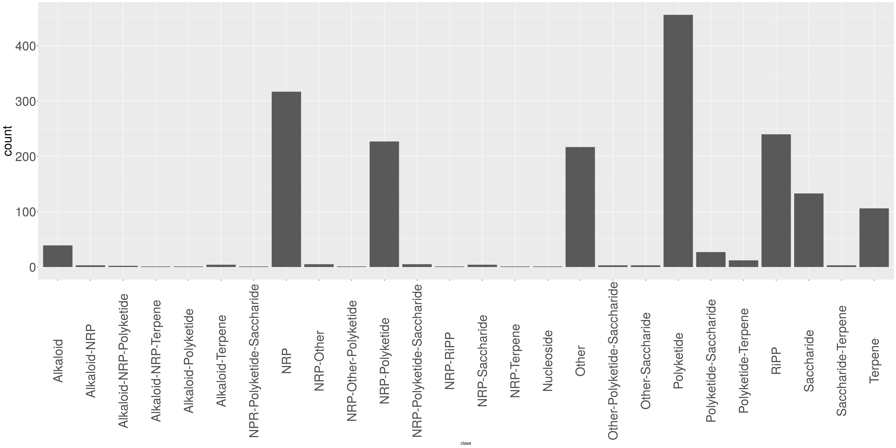

```{r setup, include=FALSE}
knitr::opts_chunk$set(echo = TRUE)
library(readr)
library(ggplot2)
library(plyr)
library( reshape )
library(data.table)
library(easyGgplot2)

library(dplyr)
```

## DATA  
CARD database contains antibiotic resistance genes.  
MIBiG database is composed by Biosynthetic gene clusters.  
antiSMASHDB contains predicted BGCs.  

## Methodology
### CARD gene families  
Genes in CARD were classified into gene families using FastORTHO with default parameters.    

### Homology searches between CARD and MIBiG  
Homology search was conducted using blast (e-vaule ) in an all vs all comparison with query antibiotic resistance genes from The Comprehensive Antibiotic Resistance Database (CARD) against genes in BGCs from MIBiG database.  

In the following sections we will refer to the following questions: How many BGCs contain an AR gene?
¿How many families of AR genes are present in BGC? Which families are over represented? How many BGCs per AR gene/Family?


# Protein families in CARD  
The following figure shows the most populated families in CARD database.
```{r FO_reading_families_CARD, echo=FALSE,message=FALSE, include=FALSE, results='hide', warnings=FALSE}
CAARD_file="CARD.FO.families"
CARDFamiliesTable <- read_delim(CAARD_file, "\t", escape_double = FALSE, col_names = FALSE, trim_ws = TRUE)
colnames(CARDFamiliesTable)=c("Gen_ID_CARD","secondary_ID_CARD","FO_Family")
head(CARDFamiliesTable)
#Gen_Id, Familia (según fastOrtho)
## Counting number of families 
AllFamilies<-length(unique(CARDFamiliesTable$FO_Family))
WO_singletons<-length(grep("ORTHO", unique(CARDFamiliesTable$FO_Family)))
```

The total number of antibiotic gene resistance families is `r AllFamilies` counting singletons. Without singletons there are `r WO_singletons` families.


<!--- Dany is currently classifing families by two methods hmmscan (pfam domains) and blasting their members -->
These first five families, in a preliminar search corresponds to:  
  
|  Family	| Number of genes	| Annotation|    
|---	|---	|---  |    
| Family 0 	| 209 	| class A broad spectrum $\beta$-lactamase |   
| Family 1  	| 166	| class A extended-spectrum $\beta$-lactamase |   
| Family 2	| 159 	| cephalosporin-hydrolyzing class C $\beta$ -lactamase |   
| Family 3 	| 138 	| class A extended-spectrum $\beta$-lactamase |   
| Family 4 	| 112 	| class D $\beta$-lactamase|   
  


```{r FO_families_CARD, echo=FALSE,message=FALSE, include=FALSE, results='hide', warnings=FALSE}
#Cada renglón es una ocurrencia de un gen de la familia 
#CARDFamiliesTable$FO_Family
sortCARD<-CARDFamiliesTable %>% group_by(FO_Family) %>% mutate(n=n())%>% ungroup() %>% arrange(-n)
First_10<-sortCARD[1:784,]
tail(First_10)
CARD_bars<-ggplot(First_10, aes(FO_Family))+ geom_histogram(stat="count")+ theme(plot.title=element_text(size=20, 
                                    face="bold", 
                                    family="American Typewriter",
                                    color="tomato",
                                    lineheight=1.2),  # title
            axis.title.y=element_text(size=35),  # Y axis title
            axis.text.x=element_text(size=30, 
                                     angle = 30,
                                     vjust=.5),  # X axis text
            axis.text.y=element_text(size=30))  # Y axis text
ggsave(file="CARD_bars.png", plot=CARD_bars, width=30, height=15)

```

  


# BGC clases in MiBIG  
The following figure shows the most populated classes in MiBIG database.

```{r MiBIG, echo=FALSE,message=FALSE, include=FALSE, results='hide', warnings=FALSE}
MIBiG_file="data/MiBIG_DB.faa.meta"
MIBiGTable <- read_delim(MIBiG_file, "\t", escape_double = FALSE, col_names = FALSE, trim_ws = TRUE)
#Gen_Id, Familia (según fastOrtho)
#Cada renglón es una ocurrencia de un gen de la familia 1
colnames(MIBiGTable)=c("BGC_ID","compound","clase","source","phylum","kingdom","completness")
BGCs<-length(unique(MIBiGTable$BGC_ID))

sortMIBiG<-MIBiGTable %>% group_by(clase) %>% mutate(n=n())%>% ungroup() %>% arrange(-n)
#First_10_MIBiG<-sortMIBiG[1:784,]
#head(First_10_MIBiG)
BIG_classes<-ggplot(sortMIBiG, aes(clase))+ geom_histogram(stat="count")+ theme(plot.title=element_text(size=20, 
                                    face="bold", 
                                    family="American Typewriter",
                                    color="tomato",
                                    lineheight=1.2),  # title
            axis.title.y=element_text(size=30),  # Y axis title
            axis.text.x=element_text(size=30, 
                                     angle = 90,
                                     vjust=.5),  # X axis text
            axis.text.y=element_text(size=30))  # Y axis text

ggsave(file="BIG_classes.png", plot=BIG_classes, width=30, height=15)

```
  

There are `r BGCs` different BGCs reported at MIBiG distributed in several classes as indicated in the following table.   
    
|Elements | MIBiG class |   
|--- |---  |    
|39|Alkaloid|      
|3|Alkaloid-NRP|  
|2|Alkaloid-NRP-Polyketide|  
|1|Alkaloid-NRP-Terpene|  
|1|Alkaloid-Polyketide|  
|4|Alkaloid-Terpene|  
|1|NPR-Polyketide-Saccharide|  
|317|NRP|  
|5|NRP-Other|  
|1|NRP-Other-Polyketide|  
|227|NRP-Polyketide|  
|5|NRP-Polyketide-Saccharide|  
|1|NRP-RiPP|  
|4|NRP-Saccharide|  
|1|NRP-Terpene|  
|1|Nucleoside|  
|217|Other|  
|3|Other-Polyketide-Saccharide|  
|3|Other-Saccharide|  
|456|Polyketide|  
|27|Polyketide-Saccharide|  
|12|Polyketide-Terpene|  
|240|RiPP|  
|133|Saccharide|  
|3|Saccharide-Terpene|  
|106|Terpene|

# Interaction CARD - MiBIG  
The following figure shows the average of CARD families by MIBiG classes

```{r CAARD_vs_MiBIG, echo=FALSE,message=FALSE, include=FALSE, results='hide', warnings=FALSE }
CARD_vs_MIBiG_file="CARDquery.blast1"
CARD_vs_MIBiGTable <- read_delim(CARD_vs_MIBiG_file, "\t", escape_double = FALSE, col_names = FALSE, trim_ws = TRUE)
#Cada renglón es una ocurrencia de un gen de la familia 1
colnames(CARD_vs_MIBiGTable)=c("Gen_ID_CARD","CARD_SOURCE","BGC_ID","MIBIG_annotation","MIBIG_gen_Id")
BGC_w_CARD<-length(unique(CARD_vs_MIBiGTable$BGC_ID))

### Merging all tables in one
CARD_MIBiG_class<-merge(CARD_vs_MIBiGTable, MIBiGTable, by, by.x="BGC_ID", by.y="BGC_ID", sort = TRUE)
CARD_MIBiG_clas2<-merge(CARD_MIBiG_class, CARDFamiliesTable, by, by.x="Gen_ID_CARD", by.y="Gen_ID_CARD", sort = TRUE)
#CARD_MIBiG_class$CARD_FO<-CARDFamiliesTable$FO_Family[CARD_MIBiG_class$Gen_ID_CARD %in% c(CARDFamiliesTable$Gen_ID_CARD)]
####__________________________________________________________________________________________________
## First of all, how many BGCs contain a hit in CARD 
## Count uniq BGCs

CARD_BIG_clases<-ggplot(CARD_MIBiG_clas2,aes(clase)) + geom_bar(aes(fill=FO_Family), width = 0.5) + theme(legend.position = "none",plot.title=element_text(size=20, 
                                    face="bold", 
                                    family="American Typewriter",
                                    color="tomato",
                                    lineheight=1.2),  # title
            axis.title.y=element_text(size=10),  # Y axis title
            axis.text.x=element_text(size=10, 
                                     angle = 90,
                                     vjust=.5),  # X axis text
            axis.text.y=element_text(size=10))  # Y axis text
ggsave(file="CARD_BIG_clases.png", plot=CARD_BIG_clases, width=30, height=15)

#+ geom_bar(aes(fill=FO_Family), width = 0.5)

## Counting CARD FastOrthoFamilies per BGC
cuentas<-count(CARD_MIBiG_clas2 %>% group_by(BGC_ID,FO_Family) %>% tally())
colnames(cuentas)=c("BGC_ID","cuentas")
head(cuentas)
## Here are in cuentas the number of FASTORTHO CARD families per BGC  
CARD_MIBiG_todo<-merge(CARD_MIBiG_clas2, cuentas, by, by.x="BGC_ID", by.y="BGC_ID", sort = TRUE)

##Now I wan thre columns class, BGC , # CARD families
Clas_BGC_Count<-CARD_MIBiG_todo %>% group_by(clase,BGC_ID,cuentas) %>% tally()
head (Clas_BGC_Count,100)
theme_set(theme_classic())


CARD_in_BIG<-ggplot(Clas_BGC_Count,aes(x = clase, y = cuentas))+ geom_boxplot() + theme(axis.text.x = element_text(angle=65, vjust=0.6)) + labs(title="Histogram on Categorical Variable", 
       subtitle="BGC Classes") + theme(legend.position = "none",plot.title=element_text(size=20, 
                                    face="bold", 
                                    family="American Typewriter",
                                    color="tomato",
                                    lineheight=1.2),  # title
            axis.title.y=element_text(size=30),  # Y axis title
            axis.text.x=element_text(size=30, 
                                     angle = 90,
                                     vjust=.5),  # X axis text
            axis.text.y=element_text(size=30))  # Y axis text

ggsave(file="CARD_in_BIG.png", plot=CARD_in_BIG, width=30, height=15)


```

  

From `r BGCs` different BGCs at MIBiG `r BGC_w_CARD` contains a CARD hit

The following figure shows which CARD families are the most  populated classes in MiBIG database.
and now an histogram by class with the number of BGCs with diferente frequecnies or CARd by color


which CAARD families are over represented in MiBiG
which MiBiG classes are over represented as CARD hits